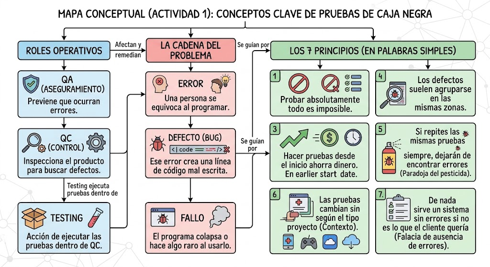

# Taller de Pruebas de Caja Negra — `presupuesto_analisis.py`

**Repositorio:** https://github.com/Gparedes3/Caja-Blanca
**Equipo:** Guillermo Paredes · Donato Oña · Mateo Villacreses

---

## Actividad 1 — Mapa Conceptual



**En resumen:** QA cuida el proceso para que no se cometan errores. QC revisa el producto para que los
defectos no salgan. El Testing es la forma de hacer que un fallo aparezca aquí, en pruebas, y no donde
el cliente lo vea. Los 7 principios nos recuerdan que nunca vamos a probarlo todo, que conviene probar
temprano, y que un programa sin bugs igual sirve de nada si no era lo que pedían.

---

## Actividad 2 — Revisión del código recibido

Recibimos `presupuesto_analisis.py` y lo dejamos tal cual, sin corregir nada.

Primero lo corrimos con datos normales (presupuesto 100000, 4 socios, 6 meses) solo para ver que arranca:

```
=== Sistema de Análisis de Presupuesto ===
Presupuesto inicial: $100000.00
Intereses generados: $72000.00
Total con intereses: $172000.00
Cuota por socio (4 socios): $43000.00
```

No se cayó. Pero los intereses ya se veían raros.

---

## Actividad 3 — Plan de pruebas

Diseñamos los casos sin mirar el código por dentro, solo pensando en qué debería hacer el programa.

**Cómo elegimos los datos:**

- **Particiones de equivalencia:** agrupamos las entradas en válidas e inválidas. Presupuesto: negativo,
  cero, positivo y texto. Socios: cero o menos, y uno o más. Meses: cero y de uno en adelante.
- **Valores límite:** probamos justo en la frontera, porque ahí es donde suelen esconderse los bugs.
  `socios = 0` es el primer valor inválido y `socios = 1` el primero válido.
- **Qué esperamos (oráculo):** interés simple = `presupuesto × 0.02 × meses`. Cuota = `total ÷ socios`.

### Casos planeados

| ID | Qué prueba | Entrada | Resultado esperado |
|---|---|---|---|
| CP-01 | Cálculo normal, todo válido | presupuesto=100000, socios=4, meses=6 | Intereses $12000.00, total $112000.00, cuota $28000.00 |
| CP-02 | Cero socios (límite inválido) | presupuesto=50000, socios=0, meses=3 | Un mensaje de error claro, sin que el programa se cierre |
| CP-03 | Texto en vez de número | presupuesto="abc", socios=2, meses=3 | Un mensaje pidiendo un número y volver a preguntar |
| CP-04 | Valores negativos | presupuesto=-5000, socios=-3, meses=6 | Rechazar los negativos y no calcular nada |

---

## Actividad 4 — Ejecución y defectos encontrados

Corrimos los cuatro casos. Solo **después** de ver el fallo entramos al código a buscar la línea culpable.

### Casos ejecutados

| ID | Entrada | Esperado | Lo que pasó | Estado |
|---|---|---|---|---|
| CP-01 | 100000, 4, 6 | Intereses $12000.00, cuota $28000.00 | Intereses **$72000.00**, cuota $43000.00. No se cayó, pero el número está 6 veces más alto | **Failed** |
| CP-02 | 50000, 0, 3 | Mensaje de error controlado | `ZeroDivisionError` en la línea 12 y el programa se corta | **Failed** |
| CP-03 | "abc", 2, 3 | Mensaje pidiendo un número | `ValueError` en la línea 3, ni siquiera alcanza a pedir los otros datos | **Failed** |
| CP-04 | -5000, -3, 6 | Rechazo de negativos | Los acepta: total $-8600.00 y una cuota **positiva** de $2866.67 | **Failed** |

**Resultado: 4 ejecutados · 0 Passed · 4 Failed.**

### Los defectos, uno por uno

**CP-01 — La fórmula está mal (línea 9)**

```python
intereses = presupuesto * tasa_interes_mensual * (meses ** 2)
```

Debería multiplicar por `meses`, no elevarlo al cuadrado. Con 6 meses multiplica por 36. Este es el más
peligroso de todos porque no lanza ningún error: el programa entrega un número que parece normal.
Si no sabes cuánto debía dar, lo das por bueno. Se arregla cambiando `(meses ** 2)` por `meses`.

**CP-02 — Divide sin revisar el divisor (línea 12)**

```python
cuota_por_socio = total / socios
```

Nunca pregunta si `socios` es cero antes de dividir. Falta un `if socios <= 0:` con su mensaje, o un
`try/except`.

**CP-03 — Convierte el texto sin protección (líneas 3, 4 y 5)**

```python
presupuesto = float(input("Ingrese el presupuesto total: "))
socios = int(input("Ingrese el número de socios: "))
meses  = int(input("Ingrese los meses de inversión: "))
```

Aplica `float()` e `int()` directo sobre lo que escriba el usuario, sin `try/except` ni volver a
preguntar. Una letra de más y se cae todo el programa. El mismo error repetido tres veces seguidas.

**CP-04 — No valida nada (falta entre las líneas 5 y 9)**

Aquí el defecto es algo que **no está**: no hay ninguna validación que rechace un presupuesto negativo o
socios negativos. Al dividir dos negativos los signos se cancelan y sale una cuota positiva para una
deuda. Matemáticamente correcto, financieramente absurdo. Se arregla validando cada dato apenas se lee.

### Fallo vs. Defecto

Vale la pena separarlo, porque no son lo mismo:

- El **defecto** es la línea mal escrita. Está siempre ahí, aunque nadie la ejecute.
- El **fallo** es lo que ves cuando esa línea se ejecuta con el dato justo.

Por ejemplo: la línea 12 puede estar años sin dar problemas si nadie escribe nunca `socios = 0`.

### Qué principio ilustra cada caso

| Caso | Fallo | Defecto | Principio |
|---|---|---|---|
| CP-01 | Número incorrecto sin error | L9 — `meses ** 2` | P1: probar muestra que hay defectos; que "funcione" no prueba nada |
| CP-02 | `ZeroDivisionError` | L12 — división sin guarda | P2/P4: los bugs se agrupan en las fronteras |
| CP-03 | `ValueError` | L3, L4, L5 — casting sin `try` | P4: el mismo error repetido en tres líneas vecinas |
| CP-04 | Cuota positiva sobre una deuda | L5–L9 — falta validación | P7: cálculo correcto, requisito incumplido |

---

## Actividad 5 — Control de versiones y entrega

Todo quedó versionado en el repositorio público:

| Archivo | Qué es |
|---|---|
| `presupuesto_analisis.py` | El código original, sin corregir |
| `calculadora.py` | La versión corregida |
| `casos_prueba.md` | Este documento |
| `README.md` | Resumen y respuestas del cierre |
| `image.png` | El mapa conceptual |
| `test_calculadora.py` | Las pruebas automáticas |
| `.github/workflows/ci.yml` | La configuración de la CI |

## Actividad 6 — Automatización de las pruebas

Los 4 casos los ejecutamos primero a mano. Después los automatizamos para no tener que
repetirlos cada vez.

Como el código original no se puede corregir (es la evidencia), escribimos la versión
arreglada en `calculadora.py`, partida en funciones que reciben datos y devuelven un
resultado. Así cada una se puede probar por separado:

| Función | Qué defecto arregla |
|---|---|
| `calcular_intereses(presupuesto, meses)` | L9 — ya no eleva los meses al cuadrado |
| `calcular_cuota(total, socios)` | L12 — avisa si los socios son 0 en vez de caerse |
| `a_numero(texto)` | L3–L5 — da un mensaje claro si no es un número |
| `analizar(...)` | La validación que faltaba: rechaza los negativos |

`test_calculadora.py` tiene 16 pruebas sobre esas funciones. Cada una se lee igual de simple:

```python
def test_intereses_con_datos_normales():
    assert calcular_intereses(100000, 6) == 12000

def test_cuota_con_cero_socios():
    with pytest.raises(ValueError):
        calcular_cuota(50000, 0)
```

Para correrlas:

```bash
pip install pytest
pytest
```

Y con `.github/workflows/ci.yml`, GitHub Actions las corre solo en cada `push` y cada pull
request, con Python 3.11 y 3.12. Si alguien rompe algo, la CI se pone roja y avisa.

**Resultado: 16 passed.**
