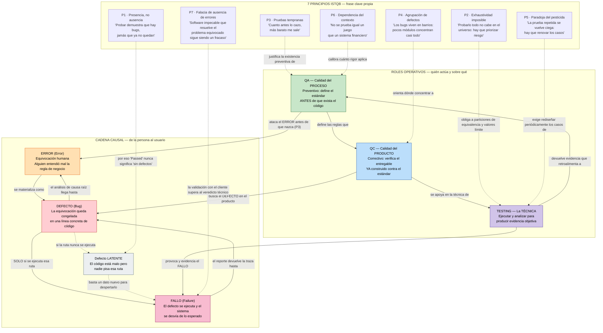

# Taller Autónomo de Pruebas de Caja Negra — `presupuesto_analisis.py`

**Repositorio:** https://github.com/Gparedes3/Caja-Blanca
**Referencias:** ISTQB Foundation Level · ISO/IEC/IEEE 29119

---

## Actividad 1 — Mapa Conceptual

> Evidencia del mapa conceptual embebida como diagrama Mermaid (se renderiza directamente en GitHub).
> Los tres bloques no están sueltos: la cadena causal explica **qué** se busca, los principios explican
> **por qué** nunca se termina de buscar, y los roles explican **quién** responde en cada momento.



### Idea que amarra los tres bloques

> **QA** intenta que el **Error** nunca ocurra (proceso), **QC** intenta que el **Defecto** no salga del taller
> (producto) y el **Testing** es la técnica que fuerza al **Fallo** a mostrarse en un ambiente controlado
> antes de que lo haga en producción. Los **7 principios** son las restricciones físicas del juego: nos dicen
> que nunca terminaremos (P1, P2), dónde y cuándo conviene buscar (P3, P4, P6), por qué debemos cambiar de
> táctica (P5), y que ganar técnicamente no es ganar si el producto no era el pedido (P7).

---

## Actividad 2 — Recepción y Verificación del Código Base

- Archivo `presupuesto_analisis.py` recibido **tal como fue entregado** (sin correcciones).
- Verificación de ejecución con datos normales (`presupuesto=100000`, `socios=4`, `meses=6`):
  el script arranca, pide las tres entradas e imprime el reporte completo **sin excepciones**.

```
=== Sistema de Análisis de Presupuesto ===
Presupuesto inicial: $100000.00
Intereses generados: $72000.00
Total con intereses: $172000.00
Cuota por socio (4 socios): $43000.00
```

> El programa **corre**, pero correr no es funcionar: el veredicto sobre ese `$72000.00` se emite en la
> Actividad 4, no aquí. (Principio 1)

---

## Actividad 3 — Diseño del Plan de Pruebas (Caja Negra Estática)

Diseño realizado **sin inspeccionar la estructura interna** del código, aplicando:

| Técnica | Aplicación en este sistema |
|---|---|
| **Partición de equivalencia** | `presupuesto`: {negativo} · {cero} · {positivo} · {no numérico} — `socios`: {≤0} · {≥1} · {no entero} — `meses`: {0} · {1..n} |
| **Valores límite** | `socios = 0` (frontera inferior inválida) y `socios = 1` (primer valor válido); `meses = 1` vs `meses = 12` |
| **Oráculo de negocio** | Interés simple mensual esperado: `presupuesto × 0.02 × meses`. Cuota esperada: `total ÷ socios`. |

### Tabla de casos — estado inicial: **planeado**

| ID | Descripción | Precondición | Entrada | Esperado | Real | Estado |
|---|---|---|---|---|---|---|
| CP-01 | Cálculo de interés con datos normales (partición válida) | Script iniciado | presupuesto=100000, socios=4, meses=6 | Intereses = $12000.00 (100000 × 0.02 × 6), total = $112000.00, cuota = $28000.00 | — | — |
| CP-02 | Comportamiento en el límite inferior inválido de socios | Script iniciado, presupuesto > 0 | presupuesto=50000, socios=0, meses=3 | Mensaje controlado de error ("el número de socios debe ser mayor a 0"), sin cerrar el programa | — | — |
| CP-03 | Entrada no numérica en presupuesto (partición inválida) | Script iniciado | presupuesto="abc", socios=2, meses=3 | Mensaje controlado ("ingrese un valor numérico") y nueva solicitud del dato | — | — |
| CP-04 | Valores negativos en presupuesto y socios (partición inválida) | Script iniciado | presupuesto=-5000, socios=-3, meses=6 | Rechazo de valores negativos con mensaje controlado; no debe calcularse cuota alguna | — | — |

---

## Actividad 4 — Ejecución Dinámica y Localización de Defectos

Ejecución real del plan y, **solo después del fallo**, inspección de Caja Blanca para aislar el defecto físico.

### Tabla de casos — ejecutada

| ID | Descripción | Precondición | Entrada | Esperado | Real | Estado |
|---|---|---|---|---|---|---|
| CP-01 | Cálculo de interés con datos normales | Script iniciado | presupuesto=100000, socios=4, meses=6 | Intereses = $12000.00, total = $112000.00, cuota = $28000.00 | Intereses = **$72000.00**, total = $172000.00, cuota = $43000.00. El programa **no se cae**: entrega un número creíble pero incorrecto (6× el valor real) | **Failed** |
| CP-02 | Límite inferior inválido de socios | Script iniciado, presupuesto > 0 | presupuesto=50000, socios=0, meses=3 | Mensaje controlado de error, sin cerrar el programa | `ZeroDivisionError: float division by zero` en línea 12 — el programa se detiene abruptamente | **Failed** |
| CP-03 | Entrada no numérica en presupuesto | Script iniciado | presupuesto="abc", socios=2, meses=3 | Mensaje controlado y nueva solicitud del dato | `ValueError: could not convert string to float: 'abc'` en línea 3 — el programa se detiene antes de pedir los otros datos | **Failed** |
| CP-04 | Valores negativos en presupuesto y socios | Script iniciado | presupuesto=-5000, socios=-3, meses=6 | Rechazo con mensaje controlado; sin cálculo de cuota | Acepta los negativos y calcula: intereses = $-3600.00, total = $-8600.00, **cuota = $2866.67 positiva** para una deuda negativa | **Failed** |

**Resumen:** 4 ejecutados · 0 Passed · **4 Failed**.

### Reportes de Defecto (Fallo ≠ Defecto)

**Reporte de Defecto: CP-01 → Defecto lógico de fórmula**
El **Fallo** (intereses inflados a $72000.00 en lugar de $12000.00) ocurre porque el **Defecto** está en la
**línea 9**:

```python
intereses = presupuesto * tasa_interes_mensual * (meses ** 2)
```

El requisito describe un interés **simple mensual**, que se acumula multiplicando por el número de meses;
el código eleva `meses` al cuadrado (`meses ** 2` = 36 en vez de 6). Es el defecto más peligroso del lote:
**no lanza excepción**, así que un usuario sin oráculo de negocio lo daría por "Passed". Corrección:
`* meses`.

**Reporte de Defecto: CP-02 → División sin validar el divisor**
El **Fallo** (`ZeroDivisionError`, el programa se detiene) ocurre porque el **Defecto** está en la
**línea 12**:

```python
cuota_por_socio = total / socios
```

El código nunca valida si `socios` es igual a cero antes de dividir. Falta la guarda previa
(`if socios <= 0:` con mensaje controlado) o el bloque `try/except ZeroDivisionError`.

**Reporte de Defecto: CP-03 → Conversión de tipo sin protección**
El **Fallo** (`ValueError`, caída al primer dato mal escrito) ocurre porque el **Defecto** está en la
**línea 3** — y se repite igual en las **líneas 4 y 5**:

```python
presupuesto = float(input("Ingrese el presupuesto total: "))
socios = int(input("Ingrese el número de socios: "))
meses  = int(input("Ingrese los meses de inversión: "))
```

Las conversiones `float()` / `int()` se aplican directamente sobre `input()` sin `try/except ValueError` ni
bucle de reintento. Un error de digitación derriba la aplicación completa.

**Reporte de Defecto: CP-04 → Ausencia de validación de dominio**
El **Fallo** (una deuda de $-8600.00 repartida como una cuota **positiva** de $2866.67) ocurre porque el
**Defecto** es una **omisión entre las líneas 5 y 9**: no existe ninguna validación de rango que rechace
`presupuesto < 0` ni `socios < 1`. Al dividir dos negativos, el signo se cancela y el sistema emite un
resultado matemáticamente válido pero **financieramente absurdo**. Corrección: validar el dominio de cada
entrada inmediatamente después de leerla.

### Trazabilidad defecto → principio ISTQB

| Caso | Fallo observado | Defecto (línea) | Principio que ilustra |
|---|---|---|---|
| CP-01 | Resultado incorrecto sin excepción | L9 — `meses ** 2` | P1: el sistema "funcionaba"; probar reveló el bug |
| CP-02 | `ZeroDivisionError` | L12 — división sin guarda | P2/P4: los defectos se agrupan en las fronteras |
| CP-03 | `ValueError` | L3 (y L4, L5) — casting sin `try` | P4: mismo patrón defectuoso repetido en un barrio de 3 líneas |
| CP-04 | Cuota positiva sobre monto negativo | L5–L9 — omisión de validación | P7: cálculo "correcto", requisito de negocio incumplido |

---

## Actividad 5 — Control de Versiones y Entrega

Artefactos versionados en el repositorio público:
`presupuesto_analisis.py` (íntegro, sin corregir) · `casos_prueba.md` · `README.md` · `.gitignore`
